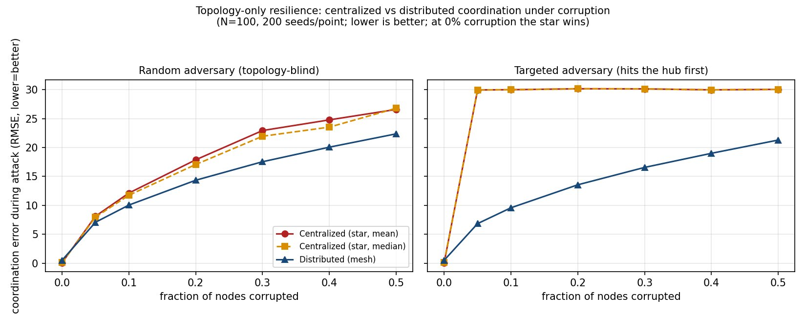

# The Red Queen's Prison — Frame-Lock and Organizational Collapse

 

A speculative, openly-licensed framework for one question: **why do systems that
are optimized for a single mode of coordination collapse when that mode is
compromised — and why does *not knowing* you're compromised make it worse?**

This repository holds the paper, plus the **one experiment we actually ran** and
the code and data to reproduce it. It is built to be checked and broken, not
believed.

> The deepest trap isn't being attacked. It's not knowing your channel is
> compromised — so you trust it *more*, lean on it *harder*, and walk into
> prepared traps believing you're winning. The paper calls that the **False Rung**.

---

## What we actually ran (and what we found)

One claim in the paper is stated as a falsifiable prediction with an experiment:
*centralized (hub-and-spoke) coordination has a single point of failure under
corruption that distributed (mesh) coordination does not.* We tested it with a
deliberately minimal, **deliberately falsifiable** agent model
(`experiment/topology_experiment.py`).

The two arms differ in **one thing only — the communication graph.** No agent is
hand-set to ignore information. The same corruption attack hits both. We swept
corruption from 0–50% over 200 random seeds per point, under a *random* adversary
(topology-blind) and a *targeted* one (corrupts the most-connected node first).



**Result (coordination error during attack — lower is better):**

| Condition | Centralized (mean) | Centralized (median) | Distributed (mesh) |
|---|---|---|---|
| **No corruption (control)** | **0.10** | 0.12 | 0.53 |
| Targeted, 10% corrupted | 29.98 | 29.98 | **9.59** |
| Random, 30% corrupted | 22.93 | 21.94 | **17.55** |

Three things to read off it:

1. **The control passes.** With *no* corruption, the centralized arm wins —
   pooling everyone's reports cancels noise. A model that favored distribution
   even here would be rigged. This one isn't.
2. **Then it crosses over.** Once corruption appears, distribution wins, and how
   sharply depends on the adversary. Against a *targeted* adversary the centralized
   arm collapses to chance-level error the instant the hub is hit; the mesh
   degrades gracefully (~3× lower error at 10%).
3. **A smarter aggregator doesn't save the center.** Giving the hub a *robust
   (median)* rule changes nothing under the targeted attack — because when the
   corrupted node **is** the hub, the aggregator is the source of the lie.

This is the paper's §10 trade-off, *earned* as a measured crossover rather than
asserted.

### What this result is NOT

- It is a statement **about this model**, not about crabs, armies, or companies.
- It tests the **topological** sub-claim only (a single aggregating node is a
  single point of failure). It does **not** establish the broader mission-command
  thesis — there is no intent-verification or agency here; the mesh is a stand-in
  for distributed decision-making.
- The targeted-star collapse is partly **true by construction** (corrupt the hub
  and the star must fail). The non-trivial findings are the clean-conditions
  crossover, the random-vs-targeted gap, and the median-can't-save-the-center result.
- **One parameter set.** A sweep over agent count, connectivity, noise, drift, and
  attack magnitude is open work (see *Open questions*).

There are **no** "5–10×" or "70–90% effectiveness" numbers here. Earlier drafts
circulated those; they were never measured and have been withdrawn from the paper.

---

## Reproduce it

```bash
pip install -r requirements.txt
cd experiment

# rerun the full sweep (≈ under a minute); writes topology_results.json
python topology_experiment.py

# regenerate Figure 1 from the data
python plot_results.py
```

`topology_results.json` in this repo is the output of the 200-seed run reported
above. Change the parameters at the top of `run_trial(...)` and tell us what
breaks.

---

## Repository contents
3. *The Red Queen's Prison* (this repository) — Zenodo DOI [10.5281/zenodo.20500531](https://doi.org/10.5281/zenodo.20500531)
